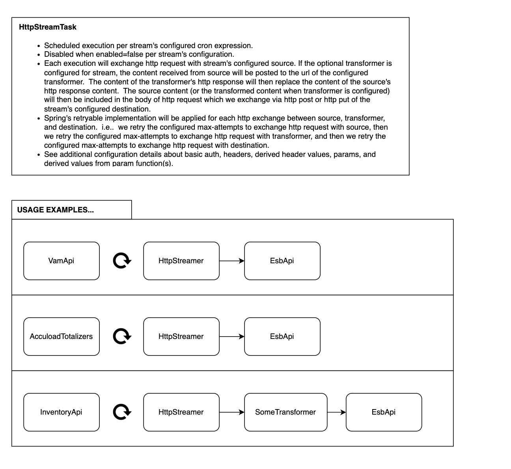

# Http Streamer
Schedule for the contents of a http source to be streamed to a specified http destination.

This service allows configuring multiple streams in `application.yml`, each with a cron expression to determine its scheduled execution. Streams can be disabled explicitly via their configuration. During execution, the service gathers HTTP response details from the source and sends an HTTP request to the destination, including the body and headers received from the source.

A stream's source and/or destination will be configured with URL, HTTP method, and headers. The headers can be configured by setting the key and value for each header in the stream's `.yml` configuration. Alternatively, you can only set the key of a header in the `.yml` and derive the key's value from an environment variable or CyberArk vault secret.

TODO insert commentary about optional transformer...

**Recommended Approach:**
- Use environment variables or CyberArk vaults in the streamer's `.yml` configuration when a header contains sensitive information (e.g., passwords, auth tokens, API keys).

**Configuration Steps:**
1. Set the environment variable key (`env.key`) and/or a CyberArk vault configuration (`cyberark.app`, `cyberark.vault`, `cyberark.object`, ...).
2. The derived value will be assigned to the corresponding header's value.

**Derivation Order:**
1. **CyberArk:** First attempt to derive a header value from CyberArk.
2. **Environment Variable:** If CyberArk fails or the value is null/empty, attempt to derive the value from the configured environment variable.
3. **Default Value:** If both CyberArk and environment variable fail or are null/empty, check if a default value is defined in `header.value` of the `.yml`.

**Retry Logic:**
- If no value can be derived from any of these methods, retry attempts will continue until the configured `max-retries` is exhausted.
- If retries are exhausted, a warning will be logged, and the current execution will stop.
- All implementations will be retried on the next scheduled task.

**HTTP Exchange Retry Logic:**
- Retry attempts per configured `max-retries` for HTTP exchange with the source.
- Retry attempts per configured `max-retries` for HTTP exchange with the destination.

## Install

## Compile

## Usage

## White Papers
> What is a white paper?
> A white paper is an authoritative, research-based document that presents information, expert analysis and an organization or author's insight into a topic or solution to a problem. Companies or vendors use these papers in business-to-business (B2B) marketing models as part of a content marketing strategy. In these contexts, white papers are written to persuade clients, stakeholders, customers and prospective customers to purchase a product or service offered by the organization. They're also used to establish an organization's authority and thought leadership in a field.

The idea here is to apply a lose definition of "white papers". When in doubt, go ahead and reference the document (and/or the image) in this section.

For the context of this readme, we want to reference any resources which can benefit the developer.  i.e.. system design, vision, usage, business operations, intended audience, "rolodex" of contacts who may be needed to give stamp of approvals or who may be helpful in consulting specific use cases from the field operations, and etc...

### Design Diagram

